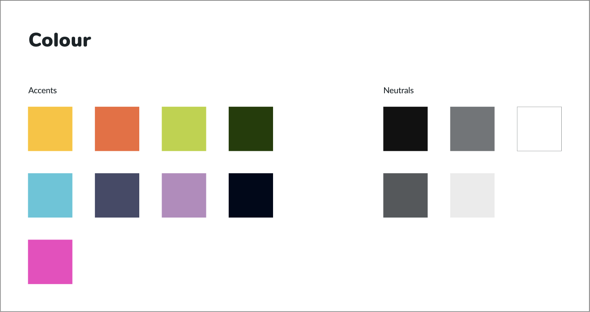
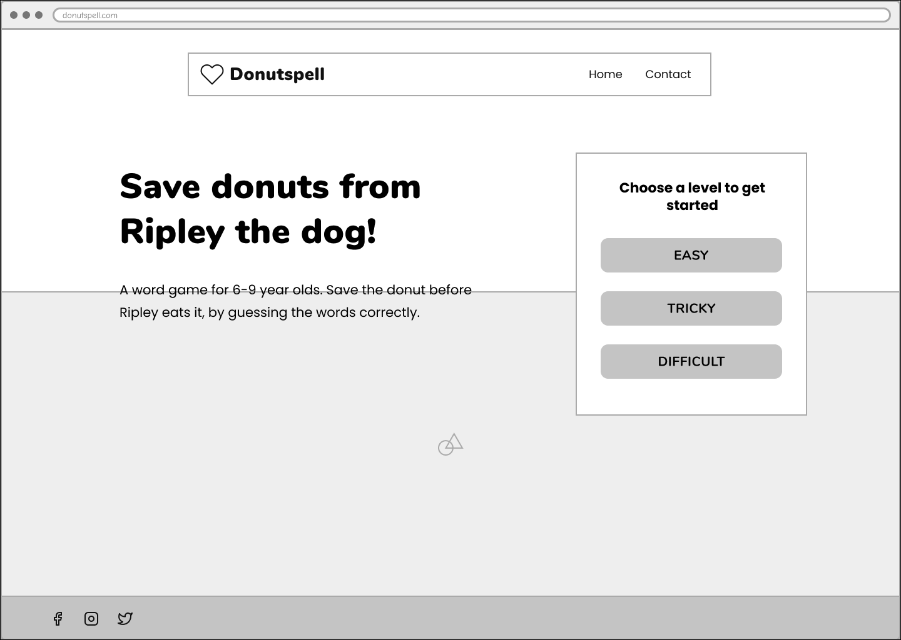
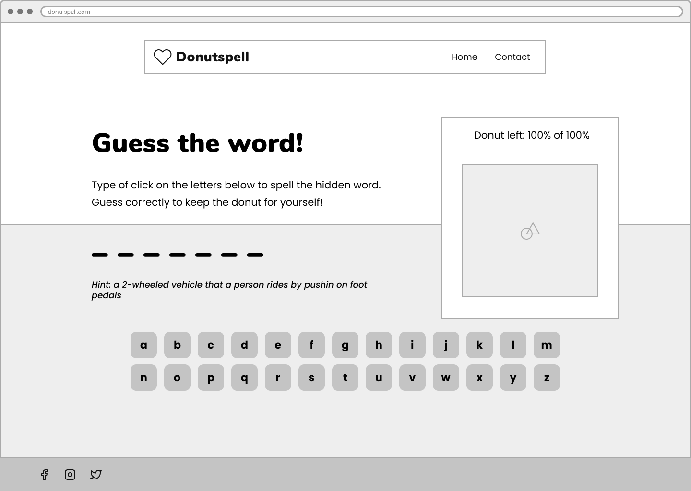
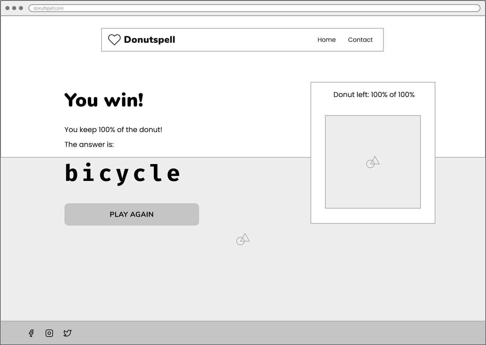
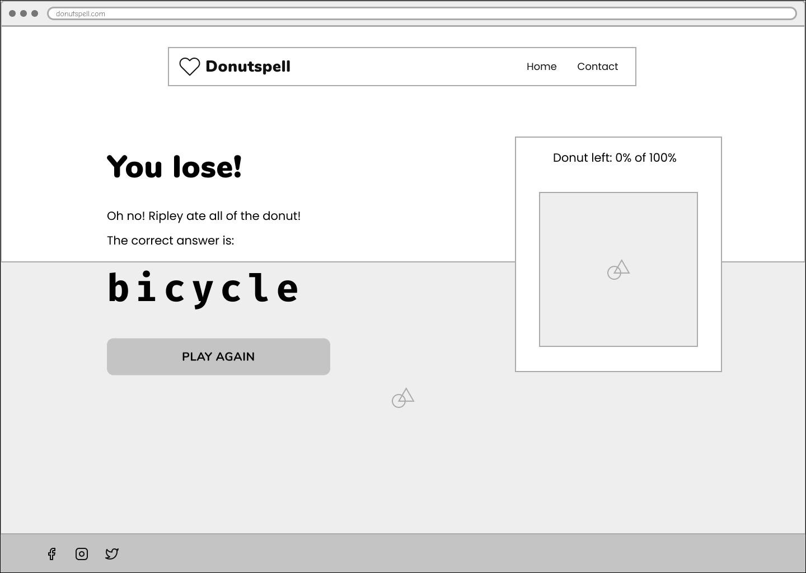
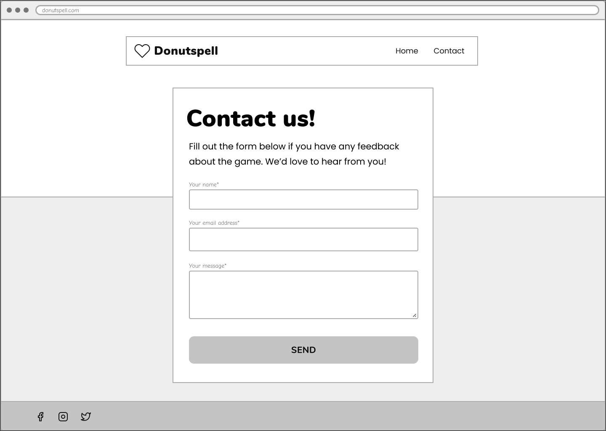
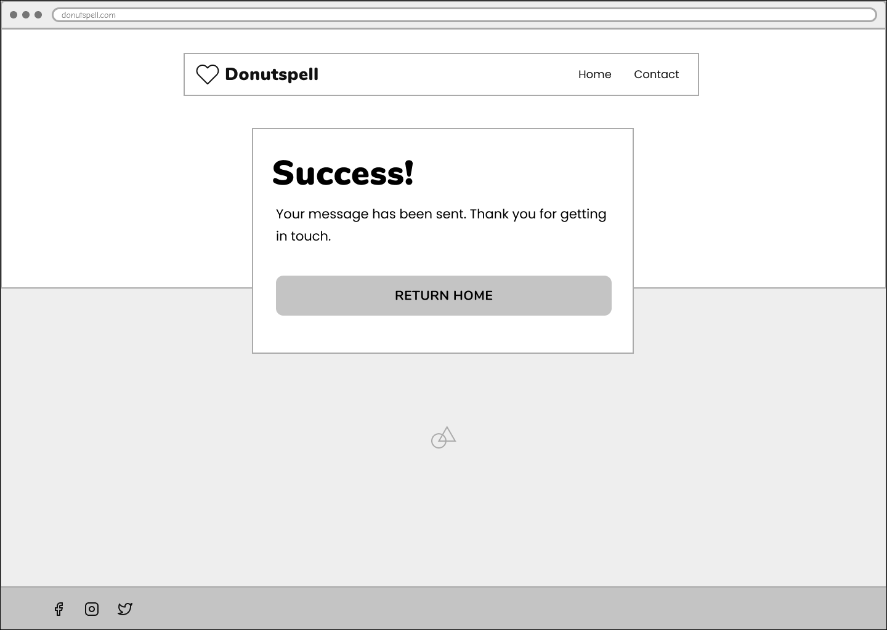
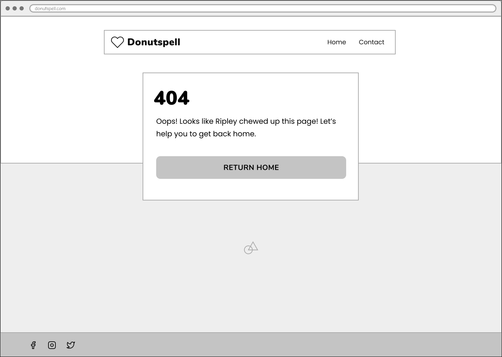

# Donutspell

A word game for 6-9 year olds. Save the donut before Ripley the dog eats them by guessing the hidden words.

The words used for the game are common "tricky" to spell words, as set by the UK school curriculum. The "Easy" level uses year 1 words (ages 5-6), the "Tricky" level uses year 2 words (ages 6-7), and the "Difficult" level uses years 3 and 4 words (ages 7-9).

[Live webpage](https://lucywoodman.github.io/donutspell/)

## Table of contents

- [Donutspell](#donutspell)
  - [Table of contents](#table-of-contents)
  - [Project goals](#project-goals)
  - [User experience](#user-experience)
    - [Target audience](#target-audience)
    - [User requirements and expectations](#user-requirements-and-expectations)
    - [User stories](#user-stories)
      - [External visitors](#external-visitors)
      - [Site owner](#site-owner)
  - [Design](#design)
    - [Colours](#colours)
    - [Fonts](#fonts)
    - [Imagery](#imagery)
    - [Structure](#structure)
    - [Wireframes](#wireframes)
  - [Features](#features)
    - [1. Logo and navigation](#1-logo-and-navigation)
    - [2. Introduction](#2-introduction)
    - [3. Footer](#3-footer)
    - [4. Main game](#4-main-game)
    - [5. Gameover (win)](#5-gameover-win)
    - [6. Gameover (lose)](#6-gameover-lose)
    - [7. Contact page](#7-contact-page)
    - [8. Form confirmation page](#8-form-confirmation-page)
    - [9. 404 page](#9-404-page)
    - [10. Fully responsive site](#10-fully-responsive-site)
  - [Technologies used](#technologies-used)
    - [Languages](#languages)
    - [Frameworks and tools](#frameworks-and-tools)
  - [Validation](#validation)
    - [HTML validation](#html-validation)
    - [CSS validation](#css-validation)
    - [JavaScript validation](#javascript-validation)
    - [Accessibility](#accessibility)
    - [Performance](#performance)
    - [Performing tests on various devices](#performing-tests-on-various-devices)
    - [Browser compatability](#browser-compatability)
    - [Testing user stories](#testing-user-stories)
  - [Bugs](#bugs)
  - [Deployment](#deployment)
  - [Credits](#credits)
    - [Media](#media)
    - [Code](#code)
    - [Reference material](#reference-material)
    - [Other](#other)
  - [Acknowledgements](#acknowledgements)

## Project goals

The user goals

- To play a fun and interactive online game.
- To improve spelling and grammar.
- To be able to use mobile/tablet devices.

The site owner goals

- To provide a fun and educational game with increasing levels of difficulty to engage online users.
- The game should be fully responsive to allow play on different devices.
- To be able to receive user feedback/suggestions via a contact page.

## User experience

### Target audience

- Children aged between 6 and 9 years old, based in the UK or learning British English.
- Teachers or parents/guardians looking for educational websites for their students/children.
- Someone that likes fun and quick word games.

### User requirements and expectations

- A clear navigation for getting around the site.
- To be able to find way back to the home page without using the browser's back button.
- A quick, fun and engaging game to play.
- A design-led experience that's a delight to see and use.
- A colour palette and typography that considers accessibility.
- Links and interactivity that work as expected.
- Consistency across pages.
- Fully responsive for viewing on any device.

### User stories

#### External visitors

1. As a user, I want to be able to pick a level of difficulty, so I can challenge myself.
2. As a user, I want to test my spelling through the game to improve my english.
3. As a user, I want the game to give me hints, so that I don't get stuck.
4. As a user, I want to be able to use either my mouse or my keyboard to choose letters.
5. As a user, I want feedback from the game to show how many wrong turns I have left.
6. As a user, I want the site to be available on different devices, so my children/students can play.
7. As a user, I want confirmation of whether I've won the game and what the correct answer is.
8. As a user, I want to see validation when filling in the form, so I know I complete it correctly.
9. As a user, I want confirmation that my feedback has been submitted from the contact form.

#### Site owner

10. As a site owner, I want users to be able to contact us with feedback or suggestions.
11. As a site owner, I don't want invalid form submissions.
12. As a site owner, I want our social links to be available for users to find.
13. As a site owner, I want users to be able to get back to the homepage without using the browser's back button.

## Design

Inspired by one of my children's favourite TV shows, "Hey Duggee", I came up with the following keywords for the brand:

- Fun
- Friendly
- Creative

### Colours

The site is designed using a bright and colourful palette (fun, creative) that feels child-centric (friendly) without being childish.

### Fonts

The friendly and rounded Nunito is used as the header font, with the cleaner but still friendly and rounded Poppins used for the body font. The monospace font Fira Code is used for the game word to prevent it from moving about too much while the letters are guessed.

### Imagery

The imagery used on the site has the brand colours throughout, to help the site to flow, look professional and avoid feeling disjointed. The illustrations are simple and rounded, to continue with the friendly, approachable feel. They're colourful and bright, to bring in the fun and creativity for the brand and to help the site catch the eye.

### Structure

The site uses the well-known and well-experienced web design pattern, to provide a familar and predictable experience to users. With the logo on the top left and main navigation in the top right. Each page has the same structure to avoid confusion, with the same footer (containing the social media links) on every page.

### Wireframes

Home page

  

Game

  

Winning game

  

Losing game

  

Contact page

  

Successful form submission page

  

404 page

  

## Features

The site consists of 3 pages and 10 features.

### 1. Logo and navigation

### 2. Introduction

### 3. Footer

### 4. Main game

### 5. Gameover (win)

### 6. Gameover (lose)

### 7. Contact page

### 8. Form confirmation page

### 9. 404 page

### 10. Fully responsive site

## Technologies used

### Languages

- HTML5
- CSS3
- JavaScript

### Frameworks and tools

Research, planning and wireframes

<ol>
   <li>VSCode (markdown)</li>
   <li>Dribbble for inspiration</li>
   <li>Figma for wireframes</li>
</ol>

Branding and design

<ol>
   <li>Figma</li>
   <li>Google Fonts and Phosphoricons</li>
   <li>Blush illustrations</li>
</ol>

Development

<ol>
   <li>Git and GitHub</li>
   <li>VSCode</li>
   <li>Figma's Favvy Favicon Exporter plugin</li>
</ol>

Docs

<ol>
   <li>VSCode (markdown)</li>
   <li>Am I Responsive for the mockup</li>
   <li>CloudApp for screenshots</li>
</ol>

## Validation

### HTML validation

### CSS validation

### JavaScript validation

### Accessibility

### Performance

### Performing tests on various devices

he website was tested on the following devices:

- Apple MacBook Pro, Apple MacBook Air
- iPhone X, iPhone 8, iPhone SE
- Huawei P30 Pro

### Browser compatability

The website was tested on the following browsers:

- Microsoft Edge
- Google Chrome
- Firefox
- Safari

### Testing user stories

## Bugs

| **Bug**     | **Fix**     |
| ----------- | ----------- |
| Example bug | Example fix |

## Deployment

The website was deployed using GitHub Pages by following these steps:

1. In the GitHub repository navigate to the Settings tab
2. On the left hand menu select Pages
3. For the source select Branch: master
4. After the webpage refreshes automaticaly you will se a ribbon on the top saying: "Your site is published at..."

You can for fork the repository by following these steps:

1. Go to the GitHub repository
2. Click on Fork button in upper right hand corner

You can clone the repository by following these steps:

1. Go to the GitHub repository
2. Locate the Code button above the list of files and click it
3. Select if you prefere to clone using HTTPS, SSH, or Github CLI and click the copy button to copy the URL to your clipboard
4. Open Git Bash
5. Change the current working directory to the one where you want the cloned directory
6. Type git clone and paste the URL from the clipboard ($ git clone https://github.com/YOUR-USERNAME/YOUR-REPOSITORY)
7. Press Enter to create your local clone.

## Credits

### Media

### Code

### Reference material

### Other

## Acknowledgements

I would like to take the opportunity to thank:

- My family, friends and colleagues for their advice, support and help with testing.
- My mentor Mo Shami for their feedback, advice and support.
- Code Institute Slack for peer reviews and advice.