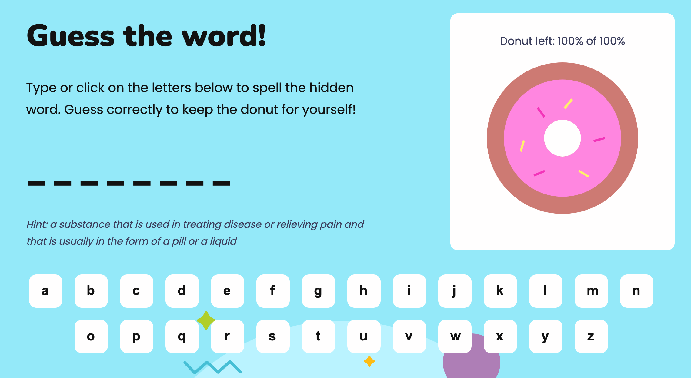

# Donutspell

A word game for 6-9 year olds. Save the donut before Ripley the dog eats them by guessing the hidden words.

The words used for the game are common "tricky" to spell words, as set by the UK school curriculum. The "Easy" level uses year 1 words (ages 5-6), the "Tricky" level uses year 2 words (ages 6-7), and the "Difficult" level uses years 3 and 4 words (ages 7-9).

[Live webpage](https://lucywoodman.github.io/donutspell/)

## Table of contents

- [Donutspell](#donutspell)
  - [Table of contents](#table-of-contents)
  - [Project goals](#project-goals)
  - [User experience](#user-experience)
    - [Target audience](#target-audience)
    - [User requirements and expectations](#user-requirements-and-expectations)
    - [User stories](#user-stories)
      - [External visitors](#external-visitors)
      - [Site owner](#site-owner)
  - [Design](#design)
    - [Colours](#colours)
    - [Fonts](#fonts)
    - [Imagery](#imagery)
    - [Structure](#structure)
    - [Wireframes](#wireframes)
  - [Features](#features)
    - [1. Logo and navigation](#1-logo-and-navigation)
    - [2. Introduction](#2-introduction)
    - [3. Footer](#3-footer)
    - [4. Main game](#4-main-game)
    - [5. Gameover (win)](#5-gameover-win)
    - [6. Gameover (lose)](#6-gameover-lose)
    - [7. Contact page](#7-contact-page)
    - [8. Form confirmation page](#8-form-confirmation-page)
    - [9. 404 page](#9-404-page)
    - [10. Fully responsive site](#10-fully-responsive-site)
  - [Technologies used](#technologies-used)
    - [Languages](#languages)
    - [Frameworks and tools](#frameworks-and-tools)
  - [Validation](#validation)
    - [HTML validation](#html-validation)
    - [CSS validation](#css-validation)
    - [JavaScript validation](#javascript-validation)
    - [Accessibility](#accessibility)
    - [Performance](#performance)
    - [Performing tests on various devices](#performing-tests-on-various-devices)
    - [Browser compatability](#browser-compatability)
    - [Testing user stories](#testing-user-stories)
  - [Bugs](#bugs)
  - [Deployment](#deployment)
  - [Credits](#credits)
    - [Media](#media)
    - [Code](#code)
    - [Reference material](#reference-material)
    - [Other](#other)
  - [Acknowledgements](#acknowledgements)

## Project goals

The user goals

- To play a fun and interactive online game.
- To improve spelling and grammar.
- To be able to use mobile/tablet devices.

The site owner goals

- To provide a fun and educational game with increasing levels of difficulty to engage online users.
- The game should be fully responsive to allow play on different devices.
- To be able to receive user feedback/suggestions via a contact page.

## User experience

### Target audience

- Children aged between 6 and 9 years old, based in the UK or learning British English.
- Teachers or parents/guardians looking for educational websites for their students/children.
- Someone that likes fun and quick word games.

### User requirements and expectations

- A clear navigation for getting around the site.
- To be able to find way back to the home page without using the browser's back button.
- A quick, fun and engaging game to play.
- A design-led experience that's a delight to see and use.
- A colour palette and typography that considers accessibility.
- Links and interactivity that work as expected.
- Consistency across pages.
- Fully responsive for viewing on any device.

### User stories

#### External visitors

1. As a user, I want to be able to pick a level of difficulty, so I can challenge myself.
2. As a user, I want to test my spelling through the game to improve my english.
3. As a user, I want the game to give me hints, so that I don't get stuck.
4. As a user, I want to be able to use either my mouse or my keyboard to choose letters.
5. As a user, I want feedback from the game to show how many wrong turns I have left.
6. As a user, I want the site to be available on different devices, so my children/students can play.
7. As a user, I want confirmation of whether I've won the game and what the correct answer is.
8. As a user, I want to see validation when filling in the form, so I know I complete it correctly.
9. As a user, I want confirmation that my feedback has been submitted from the contact form.

#### Site owner

10. As a site owner, I want to provide a fun and engaging game for users, that has an educational aspect to help teachers/children.
11. As a site owner, I want users to be able to contact us with feedback or suggestions.
12. As a site owner, I don't want invalid form submissions.
13. As a site owner, I want our social links to be available for users to find.
14. As a site owner, I want users to be able to get back to the homepage without using the browser's back button.

## Design

Inspired by one of my children's favourite TV shows, "Hey Duggee", I came up with the following keywords for the brand:

- Fun
- Friendly
- Creative

### Colours

The site is designed using a bright and colourful palette (fun, creative) that feels child-centric (friendly) without being childish.

### Fonts

The friendly and rounded Nunito is used as the header font, with the cleaner but still friendly and rounded Poppins used for the body font. The monospace font Fira Code is used for the game word to prevent it from moving about too much while the letters are guessed.

### Imagery

The imagery used on the site has the brand colours throughout, to help the site to flow, look professional and avoid feeling disjointed. The illustrations are simple and rounded, to continue with the friendly, approachable feel. They're colourful and bright, to bring in the fun and creativity for the brand and to help the site catch the eye.

### Structure

The site uses the well-known and well-experienced web design pattern, to provide a familar and predictable experience to users. With the logo on the top left and main navigation in the top right. Each page has the same structure to avoid confusion, with the same footer (containing the social media links) on every page.

### Wireframes

Home page

  

Game

  

Winning game

  

Losing game

  

Contact page

  

Successful form submission page

  

404 page

  

## Features

The site consists of 3 pages and 10 features.

### 1. Logo and navigation

The logo and navigation are predictably at the top of every page. The header is fully responsive; with the navigation menu only having two links, it sits below the logo on smaller screens. The main page links are included in the navigation, with the currently active page highlighted where applicable.

- User stories covered: 6, 14

### 2. Introduction

The content of the home page introduces users to the site, explains the site's purpose and offers a starting point for the game with a choice of difficulty levels. Below this content is an illustration of Ripley the dog, with a fun background.

The page is simple and free of clutter and distractions, making the game the main focus of the site.

- User stories covered: 1, 6, 10

### 3. Footer

The footer is predictably at the bottom of every page. It's clean and simple, with the social media links to the left side. Ripley's tail is overhanging as if she's sitting on the footer, for a bit of fun.

- User stories covered: 6, 13

### 4. Main game

The main game content includes a brief how-to-play description on the left, with the hidden guess word below. The game chooses the word at random from one of three lists (easy, medium, hard, depending on the level chosen) and replaces the letters with underscores to hide the word.

The words used for the game are common "tricky" to spell words, as set by the UK school curriculum. The "Easy" level uses year 1 words (ages 5-6), the "Tricky" level uses year 2 words (ages 6-7), and the "Difficult" level uses years 3 and 4 words (ages 7-9).

Underneath the game word is a small hint. The game uses an API to fetch a short description as a clue.

At the bottom there is the alphabet, providing the letters that can be guessed for the game word. These can be selected either with a mouse or with the keyboard. The letters will reduce their opacity once selected and become disabled, so they cannot be chosen twice.

On the right is the amount of donut left (lives left) and an illustration of a donut. There are 5 lives, or 5 sections of donut. With each incorrect answer, the donut left reduces by 20% and the illustration updates to reflect that. While not the main focus of the game, it gives a mathmatical approach to the number of lives for a touch of educational value.

- User stories covered: 2, 3, 4, 5, 6, 10

### 5. Gameover (win)

The winning content states that the user has won. It also notes how much of the donut is left for the user to "keep" and confirms this with the illustration on the right.

The correct answer is displayed, there's a little burst of confetti for fun, and below is a button to take the user back to the home page to play again.

For keyboard users, the game word has focus on this page, to make it easier to tab once for the "play again" button.

- User stories covered: 2, 6, 7, 10, 14

### 6. Gameover (lose)

The losing content states that the user has lost. It also notes that Ripley has eaten all of the donut and confirms this with the illustration on the right.

The correct answer is displayed, along with a button to take the user back to the home page to play again.

For keyboard users, the game word has focus on this page, to make it easier to tab once for the "play again" button.

- User stories covered: 2, 6, 7, 10, 14

### 7. Contact page

A straight-forward form with three fields; name, email and message. To encourage users to get in touch with any feedback or suggestions for the game.

The form is validated "on the fly" to give fast feedback to the user if one of the fields are not correctly filled out. This displays as a small, friendly, red error message below the field, and the field's border turns red. The user is unable to submit the form if there are any errors.

When the field is corrected and validates, the error disappears and the border turns green. The user can then submit the form.

- User stories covered: 6, 8, 9, 11, 12

| Contact form (default state)                  | Contact form (error state)                    |
| --------------------------------------------- | --------------------------------------------- |
|  |  |

### 8. Form confirmation page

When the form is successfully submitted, the site displays a success message, along with a thank you, and a button to return to the home page.

- User stories covered: 6, 8, 9, 11, 12, 14

### 9. 404 page

If a user happens upon a page that doesn't exist on the site, they will be shown the 404 page. This explains what happened (Ripley chewed the page, probably), and provides a button to return to the home page.

- User stories covered: 6, 14

### 10. Fully responsive site

The site has been built using the mobile first methodology. This means that the base CSS code is for mobile screens, and the media queries build upon that for the larger screen sizes.

This provides users with a consistent experience of the site, no matter the screensize. Allowing users of different ages and devices to enjoy the site.

- User stories covered: 6

| Game start                                       | Main game                                        |
| ------------------------------------------------ | ------------------------------------------------ |
|  |  |

## Technologies used

### Languages

- HTML5
- CSS3
- JavaScript

### Frameworks and tools

Research, planning and wireframes

<ol>
   <li>VSCode (markdown)</li>
   <li>Dribbble for inspiration</li>
   <li>Figma for wireframes</li>
</ol>

Branding and design

<ol>
   <li>Figma</li>
   <li>Google Fonts and Phosphoricons</li>
   <li>Blush illustrations</li>
</ol>

Development

<ol>
   <li>Git and GitHub</li>
   <li>VSCode</li>
   <li>Figma's Favvy Favicon Exporter plugin</li>
</ol>

Docs

<ol>
   <li>VSCode (markdown)</li>
   <li>Am I Responsive for the mockup</li>
   <li>CloudApp for screenshots</li>
</ol>

## Validation

### HTML validation

The [W3C Markup Validation Service](https://validator.w3.org/) was used to validate the HTML of the website. All pages pass with 0 errors and 0 warnings.

Home page

  

Contact page

  

404 page

  

### CSS validation

The [W3C Jigsaw CSS Validation Service](https://jigsaw.w3.org/css-validator/) was used to validate the CSS of the website. The CSS passes with 0 errors. There are some warnings due to using CSS variables (custom properties), which the validator does not support yet. See the [CSS Validator's GitHub](https://github.com/w3c/css-validator/pull/173#issuecomment-878349650) for more information.

style.css

  

### JavaScript validation

[JSHint](https://jshint.com/) was used to validate the JavaScript of the website. No issues were found, other than some variables that are defined outside of the scope of the file.

app.js

  

contact.js

  

game.js

  

words.js

  

### Accessibility

The [WAVE WebAIM web accessibility evaluation tool](https://wave.webaim.org/) was used to ensure the website met high accessibility standards. All pages pass with 0 errors.

Home page

  

Contact page

  

404 page

  

### Performance

[Google Lighthouse](https://developers.google.com/web/tools/lighthouse) was used to test the performance of the website.

Home page

  

Contact page

  

404 page

  

### Performing tests on various devices

The website was tested on the following devices:

- Apple MacBook Pro, Apple MacBook Air
- iPhone X, iPhone 8, iPhone SE
- Huawei P30 Pro

### Browser compatability

The website was tested on the following browsers:

- Microsoft Edge
- Google Chrome
- Firefox
- Safari

### Testing user stories

## Bugs

| **Bug**     | **Fix**     |
| ----------- | ----------- |
| Example bug | Example fix |

## Deployment

The website was deployed using GitHub Pages by following these steps:

1. In the GitHub repository navigate to the Settings tab
2. On the left hand menu select Pages
3. For the source select Branch: master
4. After the webpage refreshes automaticaly you will se a ribbon on the top saying: "Your site is published at..."

You can for fork the repository by following these steps:

1. Go to the GitHub repository
2. Click on Fork button in upper right hand corner

You can clone the repository by following these steps:

1. Go to the GitHub repository
2. Locate the Code button above the list of files and click it
3. Select if you prefere to clone using HTTPS, SSH, or Github CLI and click the copy button to copy the URL to your clipboard
4. Open Git Bash
5. Change the current working directory to the one where you want the cloned directory
6. Type git clone and paste the URL from the clipboard ($ git clone https://github.com/YOUR-USERNAME/YOUR-REPOSITORY)
7. Press Enter to create your local clone.

## Credits

### Media

### Code

### Reference material

### Other

## Acknowledgements

I would like to take the opportunity to thank:

- My family, friends and colleagues for their advice, support and help with testing.
- My mentor Mo Shami for their feedback, advice and support.
- Code Institute Slack for peer reviews and advice.